# RangeFit Shopify Technical Architecture

**Version:** 1.0
**Date:** 2025-10-23
**Status:** Draft for Review

---

## Table of Contents

1. [Executive Summary](#executive-summary)
2. [Architecture Investigation Results](#architecture-investigation-results)
3. [High-Level System Architecture](#high-level-system-architecture)
4. [Shopify Theme Architecture](#shopify-theme-architecture)
5. [Integration Architecture](#integration-architecture)
6. [Data Flow & Workflows](#data-flow--workflows)
7. [Content Architecture](#content-architecture)
8. [Access Control & Security](#access-control--security)
9. [Performance & Optimization](#performance--optimization)
10. [Development & Deployment](#development--deployment)
11. [Implementation Notes by Epic](#implementation-notes-by-epic)
12. [Risk Mitigation](#risk-mitigation)

---

## Executive Summary

RangeFit is a glucose-aware fitness platform built entirely on Shopify infrastructure with SaaS integrations. This architecture leverages Shopify as the central hub for e-commerce, content delivery, and member management, orchestrated with external services via Zapier to deliver a complete fitness subscription experience.

**Architecture Type:** SaaS Integration Platform (Shopify-Centric)
**Deployment Model:** Fully managed (no custom servers)
**Budget Constraint:** <$50/month operational costs
**Launch Timeline:** 5 weeks to MVP

### Key Architectural Decisions

1. **Platform:** Shopify Basic ($39/mo) as central hub - replaces need for custom backend
2. **Theme:** Blank slate template to minimize CSS conflicts during design system port
3. **Workout Delivery:** Shopify Blog (not Pages) for 21+ workouts - enables tagging, filtering, native SEO
4. **Access Control:** Liquid logic + customer tags (not Locksmith app) - zero additional cost
5. **Integrations:** Zapier Free tier (100 tasks/mo) orchestrating ConvertKit, Discord, Google Sheets
6. **Energy Logging:** Google Forms → Sheets - free, fast to implement, deferred database complexity

---

## Architecture Investigation Results

### Investigation 1: Shopify Theme Structure & CSS Porting

**Finding:** The "Legs on the Ground v2.0" design system (3,456 lines) can be ported to Shopify Blank slate with minimal conflicts.

**Approach:**
- **Port Strategy:** Direct migration of CSS variables, utility classes, and component styles to `assets/theme.css.liquid`
- **Estimated Effort:** 8-12 hours (Epic 1, Story 1.2)
- **Key Files:**
  - `static/css/styles.css` → `assets/theme.css.liquid`
  - Font loading via Google Fonts CDN (Plus Jakarta Sans, Inter)
  - Preserve all 8pt spacing grid, color palette (blue-500, green-500), component classes

**Risks:**
- Shopify's default CSS may conflict with utility classes → **Mitigation:** Blank slate has minimal default styles
- Liquid variable syntax `{{ }}` conflicts with CSS → **Mitigation:** Use `.css.liquid` extension, escape where needed

**Validation Required:**
- Test responsive breakpoints on actual Shopify theme
- Verify CSS minification doesn't break Liquid syntax
- Load time testing: Target <3s mobile load (NFR1)

---

### Investigation 2: Workout Library Implementation (Blog vs. Pages)

**Decision:** Use Shopify **Blog** for workout library

**Rationale:**

| Feature | Blog Posts | Pages with Metafields |
|---------|-----------|---------------------|
| **Tagging/Filtering** | ✅ Built-in tags (Low/Moderate/High) | ❌ Requires custom app or Liquid logic |
| **SEO** | ✅ Auto-generates sitemaps, RSS | ⚠️ Manual sitemap management |
| **Ease of Content Entry** | ✅ Familiar blog editor | ❌ Metafield forms are clunky |
| **Scalability** | ✅ Handles 100+ posts easily | ⚠️ Page management UI not optimized for scale |
| **RSS Feed** | ✅ Auto-generated for email integration | ❌ Not available |

**Implementation:**
- Create blog: `/blogs/workouts`
- Each of 21 workouts = 1 blog post
- Tags: `Low Intensity`, `Moderate`, `High`, `Cardio`, `Strength`, `Flexibility`, `15min`, `20min`, `30min`
- Blog template (`templates/article.liquid`) customized with workout-specific markup

**Post-MVP Consideration:**
- If AI recommendation engine needs structured data, migrate to Pages with metafields
- For MVP, blog simplicity outweighs future flexibility

---

### Investigation 3: Member-Only Access Control

**Decision:** Liquid Logic + Customer Tags (no paid app)

**Implementation:**

```liquid
 templates/article.liquid 

  
    <!-- Show full workout content -->
    <div class="workout-content">{{ article.content }}</div>
  
    
  

  

```

**Customer Tag Management via Zapier:**
- **Workflow 1:** Shopify Order (Trial/Premium) → Add tag `active_member` to customer
- **Workflow 2:** Shopify Subscription Cancelled → Remove tag `active_member` (deferred to manual cleanup for MVP)

**Why Not Locksmith App ($9/mo)?**
- Adds $108/year cost (18% of annual budget)
- Liquid logic sufficient for binary access (member vs. non-member)
- Locksmith needed only if complex rules (e.g., tiered access, time-based unlocks)

**Access Control Points:**
- `/blogs/workouts/*` - Individual workout posts (gated)
- `/blogs/workouts` - Index page (public teaser with locked content indicators)
- `/pages/dashboard` - Member dashboard (customer login required)

---

### Investigation 4: Integration Architecture

**Integration Map:**


**Integration Details:**

#### ConvertKit Integration
- **Purpose:** Email nurture sequences, workout reminders
- **Trigger:** Shopify form submission OR Zapier on order event
- **API Usage:** Form embed OR Zapier "Add Subscriber" action
- **Tags:** `Free Plan Downloaded`, `Trial Signup`, `Premium Member`
- **Sequences:**
  - 7-day nurture (free plan → trial conversion)
  - Trial onboarding (welcome → mid-trial → renewal reminder)

#### Zapier Workflows (Free Tier: 100 tasks/month)
1. **Lead Capture:** ConvertKit New Subscriber → Google Sheets (log lead)
2. **Trial Signup:** Shopify Order (Trial product) → ConvertKit Tag + Customer Tag + Sheets Log
3. **Conversion Tracking:** Shopify Subscription Renewed → Sheets Log (manual fallback for MVP)
4. **Churn Tracking:** Shopify Subscription Cancelled → Sheets Log

**Task Estimation:**
- 10 leads/day × 30 = 300 tasks (lead capture)
- 2 trials/day × 30 = 60 tasks (trial signup)
- **Total:** ~360 tasks/month → **Requires Zapier Starter Plan ($19.99/mo) immediately**

**Budget Impact:**
- Original assumption (free tier) is not viable
- Revised budget: Shopify $39 + Zapier $20 = $59/mo (⚠️ exceeds $50 target by $9)

**Alternatives:**
- Reduce lead capture logging (manual export from ConvertKit weekly)
- Use Shopify webhooks + custom serverless function (adds complexity, deferred to post-MVP)

#### Discord Integration
- **Method:** Email-based invite link (simplest, zero API complexity)
- **Invite URL:** `https://discord.gg/XXXXX` (permanent, unlimited uses)
- **Delivery:** ConvertKit "Trial Welcome" email includes Discord button
- **Automation:** No automated role assignment (manual for MVP, <50 members manageable)

**Post-MVP Consideration:**
- Discord OAuth bot for auto-role assignment based on Shopify subscription tier
- Zapier Discord integration (requires paid Discord bot hosting)

#### Google Sheets Integration
- **Analytics Sheet:** Funnel metrics (leads, trials, conversions, churn, MRR)
- **Energy Logs Sheet:** Pre/post workout energy levels
- **Data Source:** Zapier writes, Google Forms writes
- **Founder Access:** Weekly review, manual analysis (no BI tool for MVP)

---

### Investigation 5: Discord Integration Method

**Decision:** Email Invite Link (MVP) → OAuth Bot (Post-MVP)

**MVP Implementation:**
```markdown
<!-- ConvertKit Email Template -->
## Join Your Community 🏋️

Connect with 2,000+ members managing blood sugar through fitness.

[Join Discord Community](https://discord.gg/XXXXX)

**New to Discord?** It's free! Click the link, create an account, and introduce yourself in #welcome.
```

**Delivery SLA:** Email arrives within 5 minutes of trial purchase (NFR3)

**Role Assignment:** Manual founder assignment for MVP
- @Trial Member (manually assigned via Discord admin)
- @Premium Member (auto-upgrade on Day 8 if not cancelled - manual check)

**Why Not Webhook/OAuth for MVP?**
- Discord API requires bot hosting (adds complexity + cost)
- Auto-role assignment benefits negligible at <50 members
- Email invite link 100% reliable, zero maintenance

**Post-MVP Migration Path:**
1. Create Discord bot (host on Railway.app free tier or similar)
2. Zapier → Discord Webhook on trial purchase
3. Bot assigns role based on Shopify subscription status

---

### Investigation 6: Energy Logging System

**Architecture:**

```
User fills form on workout page
  ↓
Google Form (embedded iframe)
  ↓
Google Sheets ("RangeFit Energy Logs")
  ↓
Founder reviews weekly (manual analysis)
  ↓ (Post-MVP)
Data export → AI training
```

**Form Fields:**
- Email Address (auto-populated via URL parameter if possible: `?email={{customer.email}}`)
- Workout Name (dropdown: 21 workout titles)
- Pre-Workout Energy (dropdown: Low / Medium / High)
- Post-Workout Energy (dropdown: Low / Medium / High)
- Date (auto-filled)
- Notes (optional text area)

**Embed Location:**
- Bottom of each workout blog post (`templates/article.liquid`)
- Member dashboard "Log Energy" quick link (opens form)

**Sheet Structure:**
| Timestamp | Email | Workout | Pre-Energy | Post-Energy | Date | Notes |
|-----------|-------|---------|-----------|-------------|------|-------|

**Progress Tracking (FR9) - MVP Approach:**
- Manual: Founder counts energy log submissions per member weekly
- Semi-automated: Google Sheets formula `=COUNTIF(B:B, "member@email.com")` shows workout count
- Dashboard displays static placeholder: "Track your progress by logging energy after each workout"
- **Full automation deferred to post-MVP** (requires database, custom app)

**Why Not Shopify Custom Form + Database?**
- Building custom form handler requires app development (Ruby/Node.js backend)
- Shopify Forms app doesn't support conditional logic or complex workflows
- Google Forms free, familiar UX, 5-minute setup vs. 5-hour custom build

---

### Investigation 7: Performance & Security (NFR Validation)

#### Performance Targets

| Requirement | Target | Strategy |
|------------|--------|----------|
| **NFR1:** Landing page mobile load | <3 seconds | - Shopify CDN (automatic)<br>- Image optimization (TinyPNG before upload)<br>- CSS minification<br>- Lazy loading images<br>- Font preloading |
| **NFR2:** Workout page load (members) | <2 seconds | - Shopify caching<br>- Minimal JavaScript<br>- Blog posts are static content |
| **NFR3:** Email delivery time | <2 minutes | - ConvertKit automation (typically <30s)<br>- Zapier trigger delay (<2min on free tier) |

**Performance Validation Plan:**
1. Use Google PageSpeed Insights + WebPageTest
2. Test on real devices: iPhone SE (slowest modern phone), Pixel 6
3. Simulate 4G throttling in Chrome DevTools
4. Measure:
   - Largest Contentful Paint (LCP) <2.5s
   - First Input Delay (FID) <100ms
   - Cumulative Layout Shift (CLS) <0.1

**Optimization Techniques:**
```liquid
<!-- assets/theme.liquid -->
<link rel="preconnect" href="https://fonts.googleapis.com">
<link rel="preconnect" href="https://fonts.gstatic.com" crossorigin>
<link rel="preload" as="style" href="path/to/critical.css">

<!-- Lazy load images -->

```

**CSS Minification:**
- Development: `assets/theme.css.liquid` (unminified, commented)
- Production: Shopify CLI builds minified version automatically

#### Security (NFR8, NFR14-16)

| Requirement | Implementation |
|------------|----------------|
| **NFR8:** PCI Compliance | Shopify Payments (SOC 2 Type II certified) - no custom credit card handling |
| **NFR14:** Medical Disclaimers | - "Not medical advice" on all workout pages<br>- Footer link to disclaimer page<br>- Trial terms disclose no medical claims |
| **NFR15:** GDPR Compliance | - ConvertKit built-in GDPR tools (unsubscribe, data export)<br>- Shopify privacy policy page<br>- Cookie banner (Shopify app if needed) |
| **NFR16:** Data Security | - Shopify SOC 2 compliant<br>- SSL/TLS enforced (free with Shopify)<br>- No custom database = no breach risk |

**Additional Security Measures:**
- Environment variables for API keys (Shopify Secrets, not committed to Git)
- Shopify customer account password requirements (8+ chars, enforced by platform)
- Rate limiting on forms (Shopify spam protection built-in)

---

## High-Level System Architecture

### System Diagram


### Data Flow

**Lead Capture Flow:**
1. User fills form on landing page → ConvertKit
2. ConvertKit tags "Free Plan Downloaded" → Triggers nurture sequence
3. Zapier detects new subscriber → Logs to Google Sheets
4. Email 1 sends PDF immediately

**Trial Purchase Flow:**
1. User clicks "Start Trial" → Shopify checkout
2. Shopify processes $4.99 payment → Order created
3. Zapier detects order → ConvertKit tag "Trial Signup" + Shopify customer tag "active_member" + Sheets log
4. ConvertKit sends welcome email with Discord invite
5. User accesses `/pages/dashboard` → Sees workouts

**Workout Access Flow:**
1. User clicks workout from dashboard
2. Shopify Liquid checks `customer.tags contains 'active_member'`
3. If true → Render workout content
4. If false → Render paywall

**Energy Logging Flow:**
1. User completes workout → Scrolls to bottom
2. Fills Google Form (embedded iframe)
3. Form submits → Google Sheets row added
4. Founder reviews weekly → Manual analysis

---

## Shopify Theme Architecture

### Implementation Status

**✅ IMPLEMENTED** - Theme deployed to development store
**Theme ID:** 182405005605
**Store:** rangefit-dev.myshopify.com
**Location:** `/home/jay/github/is373/theme/rangefit-theme/`
**Base:** Shopify Skeleton Theme

### Theme Structure (Actual Implementation)

```
rangefit-theme/
├── layout/
│   └── theme.liquid              # Master layout with RangeFit fonts & styling
├── sections/
│   ├── header.liquid             # ✅ Custom header with logo & navigation
│   ├── hero.liquid               # ✅ Landing page hero with trust bar
│   ├── value-props.liquid        # ✅ Value proposition cards (3 blocks)
│   ├── pricing.liquid            # ✅ Pricing tiers (Free/Premium/Pro)
│   └── footer.liquid             # ✅ Footer with contact info & links
├── snippets/
│   ├── paywall-message.liquid    # 🔜 Non-member access denied (planned)
│   ├── workout-energy-log.liquid # 🔜 Google Form embed (planned)
│   └── discord-widget.liquid     # 🔜 Community widget (planned)
├── templates/
│   ├── index.json                # ✅ Homepage (hero → value-props → pricing)
│   ├── article.liquid            # 🔜 Workout blog post template (planned)
│   ├── blog.liquid               # 🔜 Workout library index (planned)
│   ├── product.json              # ✅ Trial product page (default)
│   ├── page.dashboard.liquid     # 🔜 Member dashboard (planned)
│   ├── collection.json           # ✅ Default collection template
│   ├── cart.json                 # ✅ Default cart template
│   └── customers/
│       ├── account.liquid        # ✅ Customer account management
│       ├── login.liquid          # ✅ Login page
│       └── register.liquid       # ✅ Registration page
├── assets/
│   ├── rangefit-theme.css        # ✅ 96KB (3,456 lines) - Full design system
│   ├── rangefit-theme.js         # ✅ 17KB - Mobile menu, scroll, FAQ accordion
│   └── critical.css              # ✅ 2.4KB - Skeleton theme base styles
├── blocks/
│   └── (empty - reserved for app blocks)
├── config/
│   └── settings_schema.json      # ✅ Theme customization options
└── locales/
    └── en.default.json           # ✅ English translations

Legend:
✅ Implemented and deployed
🔜 Planned for Epic 4 (Member Experience)
```

### Quick Access Links

- **Theme Editor:** https://rangefit-dev.myshopify.com/admin/themes/182405005605/editor
- **Preview URL:** https://rangefit-dev.myshopify.com/?preview_theme_id=182405005605
- **Live Store:** https://rangefit-dev.myshopify.com (when published)
- **Admin Dashboard:** https://rangefit-dev.myshopify.com/admin

### Key Liquid Files

#### `layout/theme.liquid` (Master Layout)

```liquid
<!DOCTYPE html>
<html lang="en">
<head>
  <meta charset="utf-8">
  <meta name="viewport" content="width=device-width, initial-scale=1">
  <title>{{ page_title }} - Page {{ current_page }} | RangeFit</title>

  <!-- SEO -->
  
    <meta name="description" content="{{ page_description }}">
  

  <!-- Preconnect to external resources -->
  <link rel="preconnect" href="https://fonts.googleapis.com">
  <link rel="preconnect" href="https://fonts.gstatic.com" crossorigin>

  <!-- Font Loading -->
  <link rel="preload" as="style" href="https://fonts.googleapis.com/css2?family=Plus+Jakarta+Sans:wght@400;500;600;700&family=Inter:wght@400;500;600&display=swap">

  <!-- Theme CSS -->
  {{ 'theme.css' | asset_url | stylesheet_tag }}

  <!-- Shopify Head -->
  {{ content_for_header }}

  <!-- Google Analytics -->
  <!-- GA4 code here -->
</head>
<body>
  <!-- Header Navigation -->
  <header class="header">
    <div class="container">
      <a href="/" class="logo">RangeFit</a>
      <nav class="nav">
        <a href="#services">Pricing</a>
        <a href="#testimonials">Testimonials</a>
        <a href="/blogs/workouts">Workouts</a>
        
          <a href="/pages/dashboard">Dashboard</a>
        
        <a href="/products/rangefit-trial" class="btn btn-primary">Start Trial</a>
      </nav>
      <button class="hamburger" aria-label="Menu">☰</button>
    </div>
  </header>

  <!-- Main Content -->
  <main role="main">
    {{ content_for_layout }}
  </main>

  <!-- Footer -->
  

  <!-- Scripts -->
  <script src="{{ 'main.js' | asset_url }}" defer></script>
</body>
</html>
```

#### `templates/article.liquid` (Workout Post)

```liquid
 Access Control 

  
    
  
    
  

  


<div class="workout-page">
  <div class="container">
    <article class="workout-article">
      <header class="workout-header">
        <h1>{{ article.title }}</h1>

         Workout Metadata 
        
          <div class="workout-meta">
            
              <span class="badge badge-green">Low Intensity</span>
            
              <span class="badge badge-yellow">Moderate</span>
            
              <span class="badge badge-red">High Intensity</span>
            

            <span class="workout-duration">⏱ 20 minutes</span>

            <span class="glucose-badge">🍎 Best for stable energy</span>
          </div>
        
      </header>

      
         Full Workout Content for Members 
        <div class="workout-content">
          {{ article.content }}
        </div>

         Energy Logging Form 
        <div class="energy-log-section">
          <h2>Log Your Energy</h2>
          <p>Help RangeFit learn your patterns by logging how you feel before and after this workout.</p>
          
        </div>
      
         Paywall for Non-Members 
        
      
    </article>
  </div>
</div>
```

#### `snippets/paywall-message.liquid`

```liquid
<div class="paywall card">
  <div class="paywall-icon">🔒</div>
  <h2>This Workout is Members-Only</h2>
  <p>Join RangeFit to access 21+ glucose-friendly workouts designed for your body.</p>

  <div class="paywall-features">
    <h3>What You'll Get:</h3>
    <ul>
      <li>✅ 21+ AI-Personalized Workouts</li>
      <li>✅ Daily Workout Reminders</li>
      <li>✅ Community Support (Discord)</li>
      <li>✅ Energy Tracking Tools</li>
    </ul>
  </div>

  <div class="paywall-cta">
    <a href="/products/rangefit-trial" class="btn btn-primary btn-lg">
      Start $4.99 Trial
    </a>
    <p class="paywall-subtext">7-day trial, then $14.99/month. Cancel anytime.</p>
  </div>

  <p class="paywall-login">
    Already a member? <a href="/account/login">Log in</a>
  </p>
</div>
```

#### `templates/page.dashboard.liquid` (Member Dashboard)

```liquid
 Require login 

  
  <script>window.location.href = "{{ redirect_url }}";</script>


<div class="dashboard">
  <div class="container">
    <header class="dashboard-header">
      <h1>Welcome back, {{ customer.first_name }}! 👋</h1>

       Subscription Status 
      <div class="subscription-status">
        
          <span class="status-badge status-active">✓ RangeFit Premium - Active</span>
        
          <span class="status-badge status-inactive">⚠️ No Active Subscription</span>
        
      </div>
    </header>

     Quick Stats (MVP: Static Placeholders) 
    <div class="dashboard-stats grid grid-auto-fit-sm gap-lg">
      <div class="stat-card card">
        <div class="stat-value">—</div>
        <div class="stat-label">Workouts Completed</div>
        <p class="stat-hint">Log energy after each workout to track progress</p>
      </div>

      <div class="stat-card card">
        <div class="stat-value">—</div>
        <div class="stat-label">Current Streak</div>
        <p class="stat-hint">Coming soon!</p>
      </div>

      <div class="stat-card card">
        <div class="stat-value">—</div>
        <div class="stat-label">Energy Trend</div>
        <p class="stat-hint">Based on your logs</p>
      </div>
    </div>

     Today's Recommended Workout (MVP: Static or Random) 
    <section class="recommended-workout">
      <h2>Today's Workout</h2>
      <div class="workout-card card">
        
        <div class="workout-card-content">
          <h3>Morning Energy Boost</h3>
          <div class="workout-meta">
            <span class="badge badge-green">Low Intensity</span>
            <span>⏱ 20 minutes</span>
          </div>
          <a href="/blogs/workouts/morning-energy-boost" class="btn btn-primary">Start Workout</a>
        </div>
      </div>
    </section>

     Quick Links 
    <section class="quick-links">
      <h2>Quick Actions</h2>
      <div class="grid grid-auto-fit-md gap-md">
        <a href="/blogs/workouts" class="quick-link-card card">
          <div class="icon">🏋️</div>
          <h3>Browse All Workouts</h3>
        </a>

        <a href="https://discord.gg/XXXXX" class="quick-link-card card" target="_blank">
          <div class="icon">💬</div>
          <h3>Join Community</h3>
        </a>

        <a href="https://forms.gle/XXXXX" class="quick-link-card card" target="_blank">
          <div class="icon">📊</div>
          <h3>Log Energy</h3>
        </a>

        <a href="/account" class="quick-link-card card">
          <div class="icon">⚙️</div>
          <h3>Manage Subscription</h3>
        </a>
      </div>
    </section>

     Discord Community Widget 
    <section class="community-section">
      <h2>Your Community</h2>
      <div class="discord-widget card">
        <p>Join 2,000+ members in the RangeFit Discord community</p>
        
      </div>
    </section>
  </div>
</div>
```

---

## Integration Architecture

### Zapier Workflow Specifications

#### Workflow 1: Lead Capture Logging
- **Trigger:** ConvertKit - New Subscriber with Tag "Free Plan Downloaded"
- **Filter:** None
- **Actions:**
  1. Google Sheets - Create Row
     - Spreadsheet: "RangeFit Funnel Metrics"
     - Worksheet: "Leads"
     - Columns: `Timestamp`, `First Name`, `Email`, `Source` (static: "Landing Page"), `Status` (static: "Free Plan Downloaded")

**Estimated Tasks:** ~300/month (10 leads/day × 30)

#### Workflow 2: Trial Signup Automation
- **Trigger:** Shopify - New Order
- **Filter:** Product SKU contains "RANGEFIT-TRIAL"
- **Actions:**
  1. ConvertKit - Add Subscriber to Tag "Trial Signup"
  2. ConvertKit - Remove Tag "Free Plan Downloaded" (cleanup)
  3. Shopify - Add Customer Tag "active_member"
  4. Google Sheets - Create Row (Trials sheet)

**Estimated Tasks:** ~60/month (2 trials/day × 30)

#### Workflow 3: Subscription Conversion Tracking (Manual Fallback for MVP)
- **Trigger:** Shopify - Subscription Renewed (if available)
- **Action:** Google Sheets - Create Row (Conversions sheet)
- **Fallback:** Manual daily check in Shopify admin

#### Workflow 4: Churn Tracking
- **Trigger:** Shopify - Subscription Cancelled
- **Actions:**
  1. Google Sheets - Create Row (Churn sheet)
  2. Shopify - Remove Customer Tag "active_member" (deferred to manual cleanup for MVP)

**Total Estimated Tasks:** 360+/month → **Requires Zapier Starter Plan ($19.99/mo)**

### Error Handling & Manual Fallbacks

**Zapier Failure Scenarios:**
1. **API Rate Limit Hit:** Zapier shows error in dashboard
   - **Fallback:** Export ConvertKit subscribers daily, manually import to Sheets
   - **Prevention:** Monitor task usage weekly

2. **Shopify Webhook Timeout:** Order event not received
   - **Fallback:** Daily check Shopify Orders report, manually add missing rows to Sheets
   - **Detection:** Compare Shopify order count vs. Sheets row count

3. **Google Sheets Permission Error:** Zapier loses access
   - **Fallback:** Re-authorize Google account in Zapier
   - **Prevention:** Use dedicated service account email (not personal)

**Manual Backup Process (Weekly):**
1. Export ConvertKit subscribers CSV
2. Export Shopify orders CSV
3. Cross-reference with Google Sheets
4. Manually add missing rows
5. **Time estimate:** 20-30 minutes/week

---

## Data Flow & Workflows

### Core User Journeys (Sequence Diagrams)

#### Journey 1: Lead to Free Plan Download


#### Journey 2: Trial Purchase to Workout Access


#### Journey 3: Energy Logging Workflow

```mermaid
sequenceDiagram
    actor User
    participant Workout as Workout Page
    participant Form as Google Form (Embedded)
    participant Sheets as Google Sheets
    participant Founder

    User->>Workout: Complete workout
    User->>Workout: Scroll to energy log section
    Workout->>Form: Render embedded iframe
    User->>Form: Fill energy log (Pre: Medium, Post: High)
    Form->>Sheets: Submit response
    Sheets->>Sheets: Append row (timestamp, email, workout, energies)
    Form->>User: Show confirmation message

    Note over Sheets,Founder: Weekly Review
    Founder->>Sheets: Open "Energy Logs" sheet
    Founder->>Sheets: Analyze patterns (manual)
    Founder->>Founder: Identify insights (e.g., HIIT → crashes)
```



---

## Content Architecture

### Content Types

#### 1. Static Pages (Shopify Pages)
- `/pages/dashboard` - Member Dashboard (custom template)
- `/pages/faq` - FAQ (static, links from footer)
- `/pages/privacy-policy` - Privacy Policy (Shopify template)
- `/pages/terms-of-service` - Terms of Service (customized for subscriptions)

#### 2. Blog Posts (Workout Library)
- `/blogs/workouts` - Blog index (library view)
- `/blogs/workouts/morning-energy-boost` - Individual workout post
- **Total:** 21 posts for MVP

**Blog Post Structure:**
```markdown
<!-- Blog Post Content Example -->
# Morning Energy Boost - Low Impact Cardio

**Duration:** 20 minutes
**Intensity:** Low
**Best For:** Stable energy, morning workouts before breakfast

## Glucose Guidance
🍎 This workout is designed for stable blood sugar. Best done 1-2 hours after waking, before or after breakfast. Avoid if blood sugar is below 70 mg/dL.

## What You'll Need
- No equipment required
- Comfortable space (living room, bedroom)

## Exercises

### Warm-Up (5 minutes)
1. **March in Place** - 2 minutes
   - Lift knees to hip height
   - Swing arms naturally

2. **Arm Circles** - 1 minute
   - Forward 30 sec, backward 30 sec

...

## Cool-Down (3 minutes)
...

---

**Disclaimer:** This workout is not medical advice. Consult your doctor before starting any exercise program, especially if you have diabetes, PCOS, or other health conditions.
```

**Tags Applied:**
- Intensity: `Low Intensity` OR `Moderate` OR `High`
- Type: `Cardio`, `Strength`, `Flexibility`, `Combination`
- Duration: `15min`, `20min`, `30min`
- Special: `Morning`, `Evening`, `PCOS-Friendly`, `Beginner`

#### 3. Product Pages
- `/products/rangefit-trial` - Trial product page (primary CTA destination)
- `/products/rangefit-premium` - Direct Premium subscription (secondary)
- `/products/rangefit-pro` - Pro tier (not promoted in MVP)

#### 4. Subscription Products (Shopify Products)

**Product 1: RangeFit 7-Day Trial**
- **SKU:** `RANGEFIT-TRIAL-001`
- **Price:** $4.99 for 7 days, then $14.99/month recurring
- **Subscription Type:** Trial → Monthly
- **Description:** "Try RangeFit risk-free for 7 days. Full access to AI workouts, community, and tracking. Automatically converts to $14.99/month after 7 days. Cancel anytime."

**Product 2: RangeFit Premium**
- **SKU:** `RANGEFIT-PREMIUM-001`
- **Price:** $14.99/month recurring (no trial)
- **Subscription Type:** Monthly
- **Description:** "Full RangeFit access. 21+ workouts, AI personalization, Discord community, energy tracking."

**Product 3: RangeFit Pro**
- **SKU:** `RANGEFIT-PRO-001`
- **Price:** $24.99/month recurring
- **Subscription Type:** Monthly
- **Description:** "Everything in Premium + advanced analytics, live coaching calls, priority support, beta features."

### Content Management Workflow

**Adding New Workout (Weekly Post-MVP):**
1. Founder writes workout in Google Docs
2. Copy content to Shopify Admin → Blog Posts → Create Post
3. Add tags (Intensity, Type, Duration)
4. Upload featured image (optimized with TinyPNG)
5. Set publish date (immediate or scheduled)
6. Preview on mobile device
7. Publish

**Updating Landing Page:**
1. Shopify Admin → Online Store → Customize Theme
2. Edit sections (hero text, testimonials, FAQ)
3. Preview changes
4. Save

**Managing Subscriptions:**
1. Shopify Admin → Apps → Subscriptions
2. View active subscriptions, renewals, cancellations
3. Handle customer support (pause, cancel, refund)

---

## Access Control & Security

### Access Control Matrix

| Resource | Public | Free Plan Lead | Trial Member | Premium Member | Admin |
|----------|--------|----------------|--------------|----------------|-------|
| Landing Page | ✅ | ✅ | ✅ | ✅ | ✅ |
| Lead Capture Form | ✅ | ✅ | ✅ | ✅ | ✅ |
| Workout Library Index | ✅ (teaser) | ✅ (teaser) | ✅ | ✅ | ✅ |
| Workout Blog Posts | ❌ (paywall) | ❌ (paywall) | ✅ | ✅ | ✅ |
| Member Dashboard | ❌ | ❌ | ✅ | ✅ | ✅ |
| Energy Logging Form | ❌ | ❌ | ✅ | ✅ | ✅ |
| Discord Community | ❌ | ❌ | ✅ | ✅ | ✅ |
| Shopify Admin | ❌ | ❌ | ❌ | ❌ | ✅ |

### Implementation Details

**Customer Tag Logic:**
```liquid
 Access Check Logic 



  
    
  



  <!-- Render protected content -->

  

```

**Tag Assignment Trigger:**
- Zapier Workflow: Shopify Order (Trial/Premium/Pro) → Shopify Add Customer Tag "active_member"
- **Timing:** Within 2 minutes of order (Zapier free tier latency)
- **Churn Handling:** Manual tag removal for MVP (founder removes tag weekly for cancelled subscriptions)

**Post-MVP Automation:**
- Shopify Flow app (premium feature, included in Advanced plan) for automatic tag removal on subscription cancel
- OR custom webhook → serverless function → Shopify API call

### Security Considerations

#### Authentication
- **Method:** Shopify Customer Accounts (built-in)
- **Password Policy:** Minimum 8 characters (Shopify enforced)
- **Password Reset:** Shopify built-in flow

#### Authorization
- **Access Levels:** Binary (member vs. non-member)
- **Token Storage:** Shopify session cookies (HttpOnly, Secure)

#### Data Protection
- **Payment Data:** Never touches RangeFit servers - handled by Shopify Payments (PCI DSS compliant)
- **Customer Data:** Stored in Shopify (SOC 2 Type II certified)
- **Email Data:** Stored in ConvertKit (GDPR compliant, EU data centers available)
- **Energy Logs:** Stored in Google Sheets (Founder's personal Google Workspace, GDPR compliant)

#### Vulnerability Prevention
| Vulnerability | Mitigation |
|--------------|------------|
| **XSS** | Shopify auto-escapes Liquid output (`{{ }}` is safe) |
| **CSRF** | Shopify forms include CSRF tokens automatically |
| **SQL Injection** | No custom database - Shopify handles all queries |
| **Session Hijacking** | HTTPS enforced, secure cookies |
| **Brute Force** | Shopify rate-limits login attempts |

#### Compliance Requirements

**GDPR (NFR15):**
- Privacy Policy page (required link in footer)
- ConvertKit unsubscribe link in all emails (CAN-SPAM + GDPR)
- Customer data export available via Shopify Admin (GDPR Article 20)
- Cookie consent banner (Shopify app if needed, e.g., "GDPR/CCPA Cookie Banner")

**Medical Disclaimers (NFR14):**
```html
<!-- Footer of every workout page -->
<div class="disclaimer">
  <p><strong>Disclaimer:</strong> This workout is not medical advice. Consult your doctor before starting any exercise program, especially if you have diabetes, PCOS, insulin resistance, or other health conditions. RangeFit does not diagnose, treat, or cure any disease.</p>
</div>
```

**Terms of Service Updates:**
- Customize Shopify's TOS template to include:
  - Subscription auto-renewal terms
  - Cancellation policy (anytime, no fees)
  - Refund policy (7-day trial satisfaction guarantee)
  - Fitness liability waiver

---

## Performance & Optimization

### Performance Budget

| Metric | Target | Measurement Tool |
|--------|--------|-----------------|
| **LCP (Largest Contentful Paint)** | <2.5s | PageSpeed Insights |
| **FID (First Input Delay)** | <100ms | PageSpeed Insights |
| **CLS (Cumulative Layout Shift)** | <0.1 | PageSpeed Insights |
| **Total Page Size** | <2MB | Chrome DevTools Network |
| **CSS File Size** | <150KB (minified) | Build output |
| **JavaScript File Size** | <100KB | Build output |
| **Images per Page** | Max 10 (lazy loaded) | Manual audit |

### Optimization Strategies

#### CSS Optimization
```css
/* Development: theme.css.liquid (unminified) */
/* 3,456 lines, ~200KB */

/* Production: Shopify CLI auto-minifies */
/* Output: ~120KB minified */
```

**Critical CSS Extraction (Post-MVP):**
- Inline critical above-the-fold CSS in `<head>`
- Load full CSS async

#### Image Optimization
**Process:**
1. Source images (stock photos, Canva exports)
2. Resize to max width: 1920px (desktop hero), 800px (cards)
3. Compress with TinyPNG.com (target: 80% size reduction)
4. Upload to Shopify assets
5. Generate WebP versions (Shopify CDN auto-converts)

**Lazy Loading:**
```liquid

```

#### Font Loading
```html
<!-- Preconnect to Google Fonts -->
<link rel="preconnect" href="https://fonts.googleapis.com">
<link rel="preconnect" href="https://fonts.gstatic.com" crossorigin>

<!-- Preload critical fonts -->
<link rel="preload" as="style" href="https://fonts.googleapis.com/css2?family=Plus+Jakarta+Sans:wght@600;700&display=swap">

<!-- Load fonts with display=swap -->
<link rel="stylesheet" href="https://fonts.googleapis.com/css2?family=Plus+Jakarta+Sans:wght@400;500;600;700&family=Inter:wght@400;500;600&display=swap">
```

**Font Subsetting (Post-MVP):**
- Use Google Fonts API `text` parameter to load only needed glyphs
- Or self-host fonts with Shopify assets (better caching control)

#### JavaScript Optimization
**Minimal JavaScript Philosophy:**
- Use native HTML/CSS where possible
- Defer non-critical scripts
- No heavy frameworks (React, Vue) - Liquid templating sufficient

```html
<!-- Defer analytics -->
<script src="{{ 'main.js' | asset_url }}" defer></script>

<!-- Inline critical interactions (mobile menu toggle) -->
<script>
  // Minimal inline script for instant interactivity
  document.querySelector('.hamburger').addEventListener('click', () => {
    document.querySelector('.nav').classList.toggle('active');
  });
</script>
```

#### Caching Strategy
**Shopify CDN (Automatic):**
- Static assets cached globally (CSS, JS, images)
- Cache-Control headers set by Shopify
- No custom configuration needed

**Browser Caching:**
```liquid
 Shopify automatically versions assets with ?v=timestamp 
{{ 'theme.css' | asset_url }}
<!-- Outputs: https://cdn.shopify.com/s/files/1/.../theme.css?v=1698765432 -->
```

**HTML Caching:**
- Shopify caches rendered HTML for anonymous users
- Logged-in users bypass cache (required for personalized dashboard)

### Performance Testing Plan

**Pre-Launch Testing (Week 5):**
1. Run PageSpeed Insights on:
   - Landing page
   - Trial product page
   - Workout blog post (logged out)
   - Member dashboard (logged in)
2. Test on real devices:
   - iPhone SE (slow 3G simulation)
   - Pixel 6 (4G)
   - Desktop Chrome (cable connection)
3. Fix any scores <90/100 (green zone)

**Ongoing Monitoring:**
- Weekly PageSpeed check
- Monthly real device testing

**Performance Alerts:**
- If LCP > 3s, investigate:
  - Large unoptimized images
  - Blocking JavaScript
  - Slow external fonts

---

## Development & Deployment

### Development Workflow (Actual Implementation)

#### Initial Setup (✅ COMPLETED)

**Prerequisites:**
```bash
# ✅ Node.js installed
# ✅ Shopify CLI v3.86.1 installed
npm install -g @shopify/cli @shopify/theme

# ✅ Authenticated with Shopify
shopify auth login
# Account: js426@njit.edu
# Store: rangefit-dev.myshopify.com
```

**Theme Initialization:**
```bash
# ✅ Created theme from skeleton
cd /home/jay/github/is373/theme
shopify theme init rangefit-theme
# Source: https://github.com/Shopify/skeleton-theme.git

# ✅ Migrated design system
cp /home/jay/github/is373/static/css/styles.css \
   /home/jay/github/is373/theme/rangefit-theme/assets/rangefit-theme.css

cp /home/jay/github/is373/docs_site/main.js \
   /home/jay/github/is373/theme/rangefit-theme/assets/rangefit-theme.js
```

#### Development Commands (Quick Reference)

**Start Development Server:**
```bash
cd /home/jay/github/is373/theme/rangefit-theme
shopify theme dev --store=rangefit-dev.myshopify.com
# Local preview: http://127.0.0.1:9292
# ✅ Hot reload enabled
```

**Push Changes to Shopify:**
```bash
# Push all files
shopify theme push --store=rangefit-dev.myshopify.com --theme=182405005605

# Push CSS only (faster)
shopify theme push --store=rangefit-dev.myshopify.com \
                   --theme=182405005605 \
                   --only="assets/rangefit-theme.css"

# Push specific section
shopify theme push --store=rangefit-dev.myshopify.com \
                   --theme=182405005605 \
                   --only="sections/hero.liquid"

# Force push (override conflicts)
shopify theme push --store=rangefit-dev.myshopify.com \
                   --theme=182405005605 \
                   --force
```

**Pull Changes from Shopify:**
```bash
# Pull all files (sync from Shopify to local)
shopify theme pull --store=rangefit-dev.myshopify.com --theme=182405005605

# Pull specific file
shopify theme pull --store=rangefit-dev.myshopify.com \
                   --theme=182405005605 \
                   --only="templates/index.json"
```

**Theme Validation:**
```bash
# Run theme check (linter)
shopify theme check
# ✅ 42 files inspected
# ⚠️ 5 errors (missing favicons - non-critical)
# ⚠️ 6 warnings (remote assets - acceptable)
```

**List Themes:**
```bash
shopify theme list --store=rangefit-dev.myshopify.com
# Shows all themes with IDs and publish status
```

#### Git Workflow

**Repository Structure:**
```
rangefit-shopify/
├── .git/
├── .gitignore
├── .env.example
├── README.md
├── layout/
├── sections/
├── snippets/
├── templates/
├── assets/
├── config/
└── locales/
```

**.gitignore:**
```
# Environment variables
.env
.env.local

# Shopify theme files (auto-generated)
.shopify/
config.yml

# Logs
*.log
```

**Branch Strategy:**
- `main` - Production theme (deployed to live store)
- `development` - Development theme (preview environment)
- Feature branches: `feature/epic-1-landing-page`, `fix/mobile-nav`

**Commit Workflow:**
```bash
# Create feature branch
git checkout -b feature/epic-1-landing-page

# Make changes (edit Liquid files, CSS)
# Test locally with `shopify theme dev`

# Stage and commit
git add .
git commit -m "feat(epic-1): Add hero section with CTA"

# Push to development theme for preview
shopify theme push --development

# Push to GitHub
git push origin feature/epic-1-landing-page

# Merge to main when ready
git checkout main
git merge feature/epic-1-landing-page
git push origin main

# Deploy to production
shopify theme push --live
```

### Deployment Architecture (Actual Implementation)

#### Environments

| Environment | Shopify Store | Theme ID | URL | Status |
|------------|--------------|----------|-----|--------|
| **Development** | rangefit-dev.myshopify.com | 182405005605 | https://rangefit-dev.myshopify.com/?preview_theme_id=182405005605 | ✅ Active |
| **Local Preview** | rangefit-dev.myshopify.com | (synced to 182405005605) | http://127.0.0.1:9292 | ✅ Working |
| **Production** | rangefit-dev.myshopify.com | 182404940069 | https://rangefit-dev.myshopify.com | 🔜 Ready to publish |

**Note:** Using single Shopify store (rangefit-dev.myshopify.com) with multiple themes for staging/production on Basic plan.

#### Deployment Process (Step-by-Step)

**Method 1: Safe Deployment (Recommended)**

1. **Push as Unpublished Theme:**
```bash
cd /home/jay/github/is373/theme/rangefit-theme
shopify theme push --store=rangefit-dev.myshopify.com --unpublished
```

2. **Preview & Test:**
- Output will show preview URL: `https://rangefit-dev.myshopify.com/?preview_theme_id=XXXXX`
- Test checklist:
  - [ ] All sections display correctly
  - [ ] Navigation links work
  - [ ] Images load
  - [ ] Mobile responsiveness
  - [ ] CTA buttons functional
  - [ ] Cart functionality

3. **Publish via Shopify Admin:**
```bash
# Go to: https://rangefit-dev.myshopify.com/admin/themes
# Find new theme in "Theme library"
# Click "Publish" button
```

**Method 2: Direct Update (Faster, Riskier)**

```bash
# Update existing live theme directly
shopify theme push --store=rangefit-dev.myshopify.com --theme=182404940069
# ⚠️ Warning: Immediately updates live theme
```

**Method 3: CLI Publish Command**

```bash
# Publish specific theme by ID
shopify theme publish --theme=182405005605 --store=rangefit-dev.myshopify.com
```

#### Rollback Plan

**Via Shopify Admin (Fastest):**
```bash
# 1. Go to: https://rangefit-dev.myshopify.com/admin/themes
# 2. Find previous theme (e.g., "test-data" #182357885221)
# 3. Click "Publish" button
# 4. Old theme is now live again
```

**Via CLI:**
```bash
shopify theme publish --theme=182357885221 --store=rangefit-dev.myshopify.com
# Replace theme ID with backup theme
```

#### Pre-Deployment Checklist

**Required (Epic 1):**
- [x] Hero background image uploaded
- [x] Logo uploaded in header
- [x] Navigation menu created
- [x] Footer menu created
- [x] Contact information updated
- [x] All section text reviewed
- [x] Pricing information correct
- [x] CTA buttons configured

**Testing (Epic 1):**
- [x] Tested on desktop browser
- [x] Tested on mobile browser (via dev server)
- [x] CSS loads correctly
- [x] JavaScript works (mobile menu, scroll buttons)
- [ ] No console errors (F12 → Console) - verify before publish
- [ ] Images optimized (<500KB each)

**Content (Epic 2-4):**
- [ ] Remove placeholder text
- [ ] Add real testimonials
- [ ] Update FAQ answers
- [ ] Set correct product links
- [ ] Add privacy policy link
- [ ] Add terms of service link

#### CI/CD Pipeline (Post-MVP)

**GitHub Actions Workflow (.github/workflows/deploy.yml):**
```yaml
name: Deploy to Shopify

on:
  push:
    branches:
      - main

jobs:
  deploy:
    runs-on: ubuntu-latest
    steps:
      - uses: actions/checkout@v3

      - name: Setup Node
        uses: actions/setup-node@v3
        with:
          node-version: 18

      - name: Install Shopify CLI
        run: npm install -g @shopify/cli @shopify/theme

      - name: Run theme check
        run: shopify theme check

      - name: Deploy to Production
        env:
          SHOPIFY_FLAG_STORE: ${{ secrets.SHOPIFY_STORE }}
          SHOPIFY_CLI_THEME_TOKEN: ${{ secrets.SHOPIFY_THEME_TOKEN }}
        run: shopify theme push --live --allow-live
```

**Secrets to Configure:**
- `SHOPIFY_STORE` - rangefit.myshopify.com
- `SHOPIFY_THEME_TOKEN` - Generate in Shopify Admin → Apps → Theme Access

---

## Implementation Issues & Solutions

### Issue 1: CSS Minification Failure (CRITICAL)

**Problem:**
```
Shopify CDN: Minification failed
Line 3462:0 Expected "*/" to terminate multi-line comment
Status: 404 on rangefit-theme.css
```

**Root Cause:**
- Unclosed CSS comment at line 3455-3456 in `assets/rangefit-theme.css`
- Shopify CDN failed to minify file, returned 404

**Diagnosis Process:**
1. Checked DevTools Network tab → 404 error on CSS file
2. Inspected Shopify CDN error message
3. Ran `tail -20 assets/rangefit-theme.css` to view end of file
4. Located unclosed comment:
```css
/* ======================
   END OF STYLESHEET
```

**Solution:**
```css
/* ======================
   END OF STYLESHEET
   ====================== */
```

**Fix Command:**
```bash
# Edit file to close comment
shopify theme push --store=rangefit-dev.myshopify.com \
                   --theme=182405005605 \
                   --only="assets/rangefit-theme.css"
```

**Result:** ✅ CSS now loads successfully with all styles applied

**Reference:** `/home/jay/github/is373/theme/rangefit-theme/SETUP-DOCUMENTATION.md` (lines 337-376)

---

### Issue 2: Theme Upload Temporary File Warnings

**Problem:**
```
sections/header.liquid.tmp.32484.1761279020588 contains illegal characters
templates/index.json.tmp.32484.1761279060217 Must have a .liquid file extension
```

**Root Cause:**
- Shopify CLI temporary file handling during live sync
- Dev server creates `.tmp.*` files during hot reload

**Solution:**
- These are normal warnings from dev server
- Files synced successfully despite warnings
- Used `shopify theme push --force` for clean upload when needed

**Impact:** Non-blocking, informational only

---

### Issue 3: Font Awesome & Google Fonts Loading

**Implementation:**
```liquid


<link href="https://fonts.googleapis.com/css2?family=Inter:wght@400;500;600;700;800&family=Plus+Jakarta+Sans:wght@400;500;600;700;800&display=swap" rel="stylesheet">


<link rel="stylesheet" href="https://cdnjs.cloudflare.com/ajax/libs/font-awesome/6.4.0/css/all.min.css">
```

**Trade-off:**
- ✅ **Pro:** Zero hosting cost, fast CDN delivery
- ⚠️ **Con:** External dependency (flagged by `shopify theme check`)
- ⚠️ **Con:** Performance impact (additional DNS lookup)

**Post-MVP Optimization:**
- Self-host fonts in `assets/` folder
- Use font subsetting to reduce file size
- Implement font preloading

---

### Issue 4: Missing Favicon Files

**Theme Check Warnings:**
```
Missing favicon-16x16.png
Missing favicon-32x32.png
Missing apple-touch-icon.png
```

**Status:** Non-critical for MVP, deferred to Epic 1 completion

**Solution (when implemented):**
```bash
# Upload favicon files to assets/
cp /home/jay/github/is373/docs_site/images/logos/favicon-*.png \
   /home/jay/github/is373/theme/rangefit-theme/assets/

# Push to Shopify
shopify theme push --store=rangefit-dev.myshopify.com \
                   --theme=182405005605 \
                   --only="assets/favicon-*.png"
```

---

## Implementation Notes by Epic

### Epic 1: Foundation, Landing Page & Lead Capture (✅ COMPLETED)

**Implementation Status:** ✅ Theme created, CSS/JS migrated, sections built, deployed

**Sections Implemented:**
1. ✅ `sections/header.liquid` - Custom header with logo support, navigation menu, CTA button
2. ✅ `sections/hero.liquid` - Hero with background image, title, subtitle, dual CTAs, trust bar (5 blocks)
3. ✅ `sections/value-props.liquid` - 3 value proposition cards with Font Awesome icons
4. ✅ `sections/pricing.liquid` - 3 pricing tiers (Free/Premium/Pro) with badge support
5. ✅ `sections/footer.liquid` - Footer with contact info, links, back-to-top

**Technical Implementation Highlights:**

**Story 1.2: CSS Design System Port**
- **Action:** Copy `static/css/styles.css` → `assets/theme.css.liquid`
- **Modifications Needed:**
  - Escape any `{{ }}` syntax if present (unlikely in pure CSS)
  - Test responsive breakpoints (Legs v2.0 uses max-width: 767px for mobile)
  - Verify no conflicts with Shopify's Blank slate minimal CSS
- **Testing:** PageSpeed score >90, mobile responsiveness on iPhone SE

**Story 1.7: FAQ Accordion**
- **JavaScript Required:** Add to `assets/main.js`
```javascript
// FAQ Accordion Toggle
document.querySelectorAll('.faq-question').forEach(button => {
  button.addEventListener('click', () => {
    const answer = button.nextElementSibling;
    const isOpen = answer.style.maxHeight;

    // Close all
    document.querySelectorAll('.faq-answer').forEach(a => {
      a.style.maxHeight = null;
      a.previousElementSibling.setAttribute('aria-expanded', 'false');
    });

    // Open clicked (if wasn't already open)
    if (!isOpen) {
      answer.style.maxHeight = answer.scrollHeight + 'px';
      button.setAttribute('aria-expanded', 'true');
    }
  });
});
```

**Story 1.8: Lead Capture Form Integration**
- **Decision Point:** Shopify form vs. ConvertKit embed
- **Recommendation:** ConvertKit JavaScript embed (simpler integration)
```liquid
<!-- sections/contact-form.liquid -->
<script src="https://f.convertkit.com/xxxxxxxxx/xxxxxxxxx.js"></script>
```

**Story 1.10: Analytics & SEO**
- **Google Analytics 4 Setup:**
```liquid
<!-- layout/theme.liquid -->

  <!-- Google tag (gtag.js) -->
  <script async src="https://www.googletagmanager.com/gtag/js?id=G-XXXXXXXXXX"></script>
  <script>
    window.dataLayer = window.dataLayer || [];
    function gtag(){dataLayer.push(arguments);}
    gtag('js', new Date());
    gtag('config', 'G-XXXXXXXXXX');
  </script>

```

**Risk:** Landing page load time exceeds 3s
- **Mitigation:** Compress hero image to <300KB, use WebP format
- **Validation:** PageSpeed Insights before Story 1.10 sign-off

---

### Epic 2: Email Nurture & Free Plan Delivery System

**Technical Implementation Highlights:**

**Story 2.2: Free PDF Creation**
- **Tool:** Canva (free tier)
- **Template:** Canva PDF export → Shopify Files OR ConvertKit File Hosting
- **File Size Target:** <5MB
- **Hosting:** ConvertKit auto-hosts uploaded files

**Story 2.3: Shopify → ConvertKit Integration**
- **Option A (Recommended):** Replace Shopify form with ConvertKit embed
  - Pro: Direct integration, no Zapier task
  - Con: Less control over styling
- **Option B:** Zapier middleware (Shopify form → Zapier → ConvertKit)
  - Pro: Keep Shopify form styling
  - Con: Uses 1 Zapier task per submission

**Decision:** Option A (ConvertKit embed) to minimize Zapier task usage

**Story 2.5: Zapier Lead Logging**
- **Trigger:** ConvertKit Webhook (New Subscriber)
- **Action:** Google Sheets API (Create Row)
- **Sheet ID:** Create sheet, share with Zapier service account
- **Columns:** `Timestamp`, `First Name`, `Email`, `Source`, `Status`

**Story 2.7: SPF/DKIM Setup**
- **Action:** Add DNS records to domain registrar (Namecheap)
```
TXT record: v=spf1 include:_spf.convertkit.com ~all
CNAME record: convertkit._domainkey → convertkit._domainkey.convertkit.com
```
- **Validation:** ConvertKit Domain Verification tool (green checkmark)

**Risk:** Emails landing in spam folder
- **Mitigation:**
  - Warm up sending (start with small volume, gradually increase)
  - Use founder's personal email as sender (jay@rangefit.com) vs. generic noreply@
  - Test with mail-tester.com before launch

---

### Epic 3: Trial Signup & Subscription Commerce

**Technical Implementation Highlights:**

**Story 3.1: Shopify Subscriptions Setup**
- **App:** Shopify Subscriptions (native, free with Basic plan)
- **Activation:** Shopify Admin → Apps → Subscriptions → Enable
- **Payment Gateway:** Shopify Payments (requires business verification)
- **Test Mode:** Enable sandbox mode initially

**Story 3.2: Create Subscription Products**
- **Product Creation:**
  1. Shopify Admin → Products → Add Product
  2. Set price: $4.99
  3. Enable "Subscription" option → Select "Trial" period: 7 days
  4. After trial: $14.99/month recurring
  5. Add product image, description, metafields

**Product URLs:**
- `/products/rangefit-trial`
- `/products/rangefit-premium`
- `/products/rangefit-pro`

**Story 3.4: Checkout Customization**
- **Shopify Admin:** Settings → Checkout → Branding
- **Brand Colors:** Upload RangeFit logo, set primary color (#38B2FF), accent (#38A169)
- **Checkout Extensions (Post-MVP):** Add upsells, trust badges

**Story 3.5: Trial Purchase Automation**
- **Zapier Workflow:**
  1. **Trigger:** Shopify - New Order
  2. **Filter:** Product SKU = "RANGEFIT-TRIAL-001"
  3. **Action 1:** ConvertKit - Add Tag "Trial Signup"
  4. **Action 2:** Shopify - Add Customer Tag "active_member"
  5. **Action 3:** Google Sheets - Log trial

**Testing Checklist:**
- Complete test purchase with Shopify Bogus Gateway (test card: 1)
- Verify customer tag applied within 2 minutes
- Verify ConvertKit email arrives
- Verify Google Sheets row added

**Risk:** Trial → Paid conversion not automatically tracked
- **Mitigation:** Shopify doesn't have direct "subscription renewed" trigger on free Subscriptions app
- **Workaround:** Daily manual check (Shopify Admin → Subscriptions → Filter "Active"), export CSV, compare with Sheets

---

### Epic 4: Member Experience, Workout Library & Community Integration

**Technical Implementation Highlights:**

**Story 4.1: Content Creation**
- **Tool:** Google Docs for workout scripting
- **Structure Template:**
```markdown
# [Workout Title]

**Duration:** 20 minutes
**Intensity:** Low / Moderate / High
**Best For:** [Glucose timing guidance]

## What You'll Need
- No equipment

## Exercises

### Warm-Up (5 min)
1. [Exercise name] - [Reps/time]
   - Form tip

...

## Cool-Down (3 min)

---

**Disclaimer:** Not medical advice...
```

**Story 4.2: Blog Implementation**
- **Blog Setup:** Shopify Admin → Online Store → Blog Posts → Manage Blogs → Create "Workouts"
- **Permalink:** `/blogs/workouts`
- **21 Posts:** Copy content from Google Docs → Paste into Shopify Blog Post editor
- **Tags:** Apply manually during post creation

**Liquid Template Customization:**
```liquid
<!-- templates/article.liquid -->
<!-- Access control logic (see Section 8) -->

<!-- Workout metadata display -->
<div class="workout-meta">
  
    
      <span class="badge">{{ tag }}</span>
    
  
</div>
```

**Story 4.4: Access Control Implementation**
- **Liquid Logic:** See Section 8 (Access Control & Security)
- **Tag Assignment:** Zapier workflow (Story 3.5) adds `active_member` tag
- **Testing:**
  - Log out → Try to access `/blogs/workouts/morning-energy-boost` → See paywall
  - Log in as trial customer → Access granted

**Story 4.5: Energy Logging Form**
- **Google Form Creation:**
  1. Google Forms → New Form: "RangeFit Energy Log"
  2. Add fields: Email, Workout (dropdown), Pre-Energy (dropdown), Post-Energy, Date, Notes
  3. Set "Responses" → Google Sheets: "RangeFit Energy Logs"
  4. Get embed code

- **Embed in Liquid:**
```liquid
<!-- snippets/workout-energy-log.liquid -->
<div class="energy-log-embed">
  <iframe src="https://docs.google.com/forms/d/e/XXXXX/viewform?embedded=true&entry.1234567={{ customer_email }}&entry.7891011={{ workout_name }}"
          width="100%"
          height="800"
          frameborder="0"
          marginheight="0"
          marginwidth="0">
    Loading…
  </iframe>
</div>
```

- **Pre-populate Email:** Use URL parameters `?entry.XXXXX={{ customer.email }}`
- **Pre-populate Workout:** `&entry.YYYYY={{ article.title }}`

**Story 4.6: Discord Setup**
- **Create Server:** Discord → Create Server → "RangeFit Community"
- **Channels:** #welcome, #wins, #questions, #pcos-crew, #accountability, #off-topic, #announcements
- **Roles:** @Trial Member, @Premium Member, @Founder
- **Generate Invite:** Discord → Invite People → "Never Expire" + "Unlimited Uses" → Copy link
- **Add to Email:** ConvertKit template (Story 3.5 Email 1)

**Discord Widget Embed:**
```liquid
<!-- snippets/discord-widget.liquid -->
<iframe src="https://discord.com/widget?id=SERVER_ID&theme=light"
        width="350"
        height="500"
        allowtransparency="true"
        frameborder="0"
        sandbox="allow-popups allow-popups-to-escape-sandbox allow-same-origin allow-scripts">
</iframe>
```

**Risk:** Discord invite link expires accidentally
- **Mitigation:** Set invite to "Never Expire" (requires Admin permissions)
- **Backup:** Create 2-3 backup invite links, store in password manager

---

## Risk Mitigation

### Risk Register

| Risk | Impact | Probability | Mitigation Strategy | Contingency Plan |
|------|--------|------------|---------------------|------------------|
| **Budget Overrun (Zapier)** | High | High (99%) | - Reduce lead capture logging (manual export)<br>- Upgrade to Starter ($19.99/mo) | - Manual weekly exports from ConvertKit<br>- Build custom webhook handler (post-MVP) |
| **CSS Conflicts (Shopify)** | Medium | Low (20%) | - Use Blank slate theme (minimal default CSS)<br>- Test all pages before launch | - Incrementally port CSS, test each section<br>- Use scoped CSS classes `.rangefit-*` |
| **Workout Access Bypass** | Critical | Low (10%) | - Liquid logic prevents server-side rendering<br>- Customer tags required | - Monitor for unauthorized access<br>- Add IP-based rate limiting (Shopify apps) |
| **Email Deliverability** | High | Medium (40%) | - SPF/DKIM setup<br>- Warm up sending<br>- Use personal sender email | - Switch to Mailgun/SendGrid (higher deliverability)<br>- Manual email sending if automation fails |
| **Zapier Downtime** | High | Low (15%) | - Monitor Zapier status page<br>- Set up error notifications | - Manual daily checks (Shopify orders → Sheets)<br>- 48-hour SLA for manual fallback |
| **Shopify Subscriptions Bug** | Critical | Low (10%) | - Thorough testing in sandbox<br>- Beta test with 10 real users | - Switch to Recharge app ($99/mo) if critical bugs<br>- Manual subscription management |
| **Discord Spam/Abuse** | Medium | Medium (50%) | - Enable AutoMod<br>- Set verification level (email required)<br>- Active founder moderation | - Hire moderator ($200/mo contractor)<br>- Implement strict rules + bans |
| **Performance < 3s Load** | High | Medium (30%) | - Image optimization<br>- CSS minification<br>- Lazy loading | - Reduce hero image size<br>- Remove heavy fonts<br>- Disable non-critical features |
| **Trial → Paid Conversion Tracking Failure** | Medium | High (60%) | - Zapier workflow for renewals<br>- Daily manual checks | - Accept manual tracking for MVP<br>- Build custom Shopify app post-MVP |
| **Google Forms Data Loss** | Medium | Low (5%) | - Google Sheets auto-saves<br>- Weekly backup (export CSV) | - Restore from CSV backup<br>- Rebuild form (5-minute task) |

### Blockers & Dependencies

**Critical Path Blockers:**

1. **Shopify Account Approval (Week 1)**
   - **Dependency:** Business verification for Shopify Payments
   - **Risk:** Approval delayed or rejected
   - **Mitigation:** Apply with accurate business info, respond promptly to verification requests
   - **Contingency:** Use Stripe as payment gateway (2-day setup vs. instant Shopify Payments)

2. **Domain DNS Propagation (Week 1)**
   - **Dependency:** Domain registered, DNS records updated
   - **Risk:** 24-48 hour propagation delay
   - **Mitigation:** Update DNS early (Day 1), use `dig` to verify
   - **Contingency:** Launch on `rangefit.myshopify.com` subdomain initially

3. **ConvertKit SPF/DKIM Verification (Week 2)**
   - **Dependency:** Domain ownership, DNS access
   - **Risk:** DNS propagation delay, incorrect records
   - **Mitigation:** Follow ConvertKit's exact instructions, use DNS checker tools
   - **Contingency:** Send from ConvertKit shared domain (lower deliverability but functional)

4. **21 Workouts Content Complete (Week 4)**
   - **Dependency:** Founder writes all workout scripts
   - **Risk:** Content creation delayed (time-intensive)
   - **Mitigation:** Start writing Week 1, aim for 3 workouts/week
   - **Contingency:** Launch with 14 workouts (2 weeks of content), add remaining post-launch

**Non-Blocking Dependencies:**
- Google Forms setup (can launch without energy logging, add Week 6)
- Discord community seeding (can launch with empty server, seed during beta)
- Analytics dashboards (manual tracking sufficient for MVP)

### Rollback Plan

**Production Deployment Rollback:**
```bash
# If theme deployment breaks site
shopify theme publish --theme-id PREVIOUS_WORKING_VERSION

# Restore from Git
git revert HEAD
shopify theme push --live
```

**Data Loss Recovery:**
- **Shopify:** Platform maintains backups (no action needed)
- **ConvertKit:** Export subscribers CSV weekly (backup in Google Drive)
- **Google Sheets:** Version history (File → Version History → Restore)

---

## Documentation References

### Theme Implementation Documentation

The following documentation files provide detailed implementation guidance and are located in `/home/jay/github/is373/theme/rangefit-theme/`:

#### 1. Quick Start Guide
**File:** `QUICK-START.md`
**Purpose:** Fast reference for common development tasks

**Key Contents:**
- Start development server commands
- Deploy changes (push CSS, sections, full theme)
- Theme health check
- Important links (admin, preview, editor)
- Edit content via Theme Editor
- Common issues & troubleshooting
- File structure reference
- Next TODOs checklist

**Use When:** Daily development, quick command lookup

---

#### 2. Setup Documentation
**File:** `SETUP-DOCUMENTATION.md`
**Purpose:** Complete technical setup and implementation record

**Key Contents:**
- Initial setup process (CLI installation, authentication)
- Theme structure (actual files created)
- Design integration (CSS/JS migration)
- Sections created (hero, value-props, pricing, header, footer)
- Issues & solutions (CSS minification, upload warnings)
- Configuration details
- Development workflow
- Theme customization guide
- Next steps roadmap
- Technical reference

**Use When:** Onboarding new developers, troubleshooting, understanding architecture decisions

---

#### 3. Production Deployment Guide
**File:** `PUBLISH-TO-PRODUCTION.md`
**Purpose:** Safe production deployment checklist

**Key Contents:**
- Recommended deployment method (safe 3-step process)
- Alternative methods (direct update, CLI publish)
- Pre-deployment checklist (required items, testing, content)
- Rollback instructions (admin & CLI methods)
- Post-publishing monitoring
- Troubleshooting (broken theme, missing images, sections)
- Success checklist

**Use When:** Publishing theme to production, rolling back changes, verifying deployment

---

### Architecture Documentation Cross-Reference

| Architecture Section | Implementation Documentation | Line Reference |
|---------------------|------------------------------|----------------|
| Shopify Theme Structure | `SETUP-DOCUMENTATION.md` → Theme Structure | Lines 80-106 |
| Development Workflow | `QUICK-START.md` → Common Commands | Lines 7-35 |
| Deployment Process | `PUBLISH-TO-PRODUCTION.md` → Deployment Methods | Lines 9-62 |
| Issue: CSS Minification | `SETUP-DOCUMENTATION.md` → Issue 3 | Lines 337-376 |
| Issue: Upload Warnings | `SETUP-DOCUMENTATION.md` → Issue 1 | Lines 297-314 |
| Theme Customization | `SETUP-DOCUMENTATION.md` → Theme Customization | Lines 493-527 |
| Sections Implemented | `SETUP-DOCUMENTATION.md` → Sections Created | Lines 164-295 |
| Next Steps | `SETUP-DOCUMENTATION.md` → Next Steps | Lines 529-624 |
| Pre-Publish Checklist | `PUBLISH-TO-PRODUCTION.md` → Pre-Publish Checklist | Lines 64-93 |

---

### Key Implementation Artifacts

**Theme Location:**
```
/home/jay/github/is373/theme/rangefit-theme/
```

**Source Files (Reference):**
- Static CSS: `/home/jay/github/is373/static/css/styles.css`
- Static JS: `/home/jay/github/is373/docs_site/main.js`
- Static HTML: `/home/jay/github/is373/docs_site/index.html`

**Active Theme Files:**
- Theme CSS: `/home/jay/github/is373/theme/rangefit-theme/assets/rangefit-theme.css` (96KB)
- Theme JS: `/home/jay/github/is373/theme/rangefit-theme/assets/rangefit-theme.js` (17KB)
- Layout: `/home/jay/github/is373/theme/rangefit-theme/layout/theme.liquid`
- Sections: `/home/jay/github/is373/theme/rangefit-theme/sections/*.liquid`

**Shopify Admin Links:**
- Store Admin: https://rangefit-dev.myshopify.com/admin
- Theme Editor: https://rangefit-dev.myshopify.com/admin/themes/182405005605/editor
- Theme Preview: https://rangefit-dev.myshopify.com/?preview_theme_id=182405005605
- Themes List: https://rangefit-dev.myshopify.com/admin/themes

---

## Appendix A: Technology Choices Summary

| Category | Technology | Version | Rationale |
|----------|-----------|---------|-----------|
| **Platform** | Shopify Basic | - | All-in-one ecommerce, no custom backend needed |
| **Theme** | Blank Slate | Latest | Minimal CSS conflicts for design system port |
| **Frontend Language** | Liquid (Shopify templating) | - | Required for Shopify themes |
| **Styling** | Custom CSS (Legs v2.0) | - | 3,456-line design system already built |
| **JavaScript** | Vanilla JS (ES6+) | - | Minimal needs (accordion, menu), no framework overhead |
| **Email Automation** | ConvertKit | - | Free up to 1,000 subs, visual automation builder |
| **Workflow Orchestration** | Zapier | Starter Plan | Connects Shopify + ConvertKit + Sheets |
| **Community** | Discord | - | Free, familiar to target audience |
| **Analytics** | Google Sheets | - | Free, no BI tool needed for <100 members |
| **Energy Logging** | Google Forms | - | Free, 5-minute setup, defers database complexity |
| **Payments** | Shopify Payments | - | PCI compliant, built-in subscriptions |
| **Domain** | Namecheap | - | $10/year .com domain |
| **Version Control** | Git + GitHub | - | Standard development workflow |
| **Deployment** | Shopify CLI | Latest | Official theme deployment tool |

---

## Appendix B: Estimated Effort by Epic

| Epic | Stories | Estimated Hours | Dependencies |
|------|---------|----------------|--------------|
| **Epic 1:** Foundation & Landing Page | 10 | 40-50 hours | - Shopify account<br>- Domain<br>- Design system CSS |
| **Epic 2:** Email Nurture | 7 | 20-25 hours | - ConvertKit account<br>- PDF created<br>- Epic 1 complete |
| **Epic 3:** Trial & Subscriptions | 8 | 30-35 hours | - Shopify Payments approved<br>- Epic 1-2 complete |
| **Epic 4:** Member Experience | 7 | 35-40 hours | - 21 workouts written<br>- Discord server created<br>- Epic 3 complete |
| **Total** | **32 stories** | **125-150 hours** | **5-week timeline** |

**Weekly Breakdown:**
- Week 1: Epic 1 (Stories 1.1-1.5) - Foundation, theme setup, CSS port
- Week 2: Epic 1 (Stories 1.6-1.10) - Landing page sections, SEO
- Week 3: Epic 2 - Email automation, PDF, Zapier
- Week 4: Epic 3 - Subscriptions, trial flow, checkout
- Week 5: Epic 4 - Workout library, access control, Discord, final testing

**Developer Allocation:**
- Solo founder (no coding experience): Use low-code tools, Shopify admin UI
- **OR** Hire contractor: 30 hours/week × $50/hr = $1,500/week × 5 weeks = **$7,500 total**

---

## Appendix C: Post-MVP Enhancements

**Phase 2 (Months 4-6):**
1. **AI Recommendation Engine**
   - Migrate workouts to Shopify Pages with metafields (structured data)
   - Build custom app: Google Sheets energy logs → TensorFlow.js model → Workout recommendations
   - Display personalized "Today's Workout" on dashboard

2. **Automated Progress Tracking**
   - Build custom Shopify app: Track workout completions in database
   - Dashboard shows: Workouts completed, streak, energy trend charts
   - Gamification: Badges for milestones (7-day streak, 30 workouts, etc.)

3. **Discord Bot Integration**
   - Auto-assign roles based on Shopify subscription tier
   - Daily workout reminder posts in #accountability
   - Integration with energy logging (post workout completion to Discord)

4. **Advanced Analytics**
   - Migrate from Google Sheets → Custom dashboard (Retool, Metabase)
   - Real-time MRR tracking, cohort analysis, churn prediction

5. **Mobile App (React Native)**
   - Offline workout access
   - Apple Health integration
   - Push notifications for workout reminders

**Budget for Phase 2:** ~$5,000-$10,000 (custom app development)

---

## Change Log

| Date | Version | Description | Author |
|------|---------|-------------|--------|
| 2025-10-23 | 1.0 | Initial architecture document | Winston (Architect Agent) |
| 2025-10-24 | 1.1 | **Updated with actual theme implementation**<br>- Added actual theme structure (Epic 1 completed)<br>- Updated development workflow with real commands<br>- Added deployment process with theme IDs<br>- Documented implementation issues & solutions<br>- Added documentation references section<br>- Updated status indicators (✅/🔜) throughout | Winston (Architect Agent) |

---

**Document Status:** ✅ Updated with Epic 1 Implementation Details

**Epic 1 Status:** ✅ COMPLETED
- Theme initialized from Shopify Skeleton
- Design system (CSS/JS) migrated
- Core sections implemented (header, hero, value-props, pricing, footer)
- Deployed to development store (Theme ID: 182405005605)
- CSS minification issue resolved
- Ready for content population

**Next Steps:**
1. ✅ ~~Epic 1 (Week 1): Shopify setup, theme initialization~~ **COMPLETED**
2. 🔜 Epic 1 Finalization: Upload images, create menus, add testimonials/FAQ sections
3. 🔜 Epic 2 (Week 3): Email automation, PDF creation, Zapier integration
4. 🔜 Epic 3 (Week 4): Subscriptions, trial flow, checkout
5. 🔜 Epic 4 (Week 5): Workout library, access control, Discord

**Implementation Artifacts:**
- **Theme Documentation:** `/home/jay/github/is373/theme/rangefit-theme/SETUP-DOCUMENTATION.md`
- **Quick Reference:** `/home/jay/github/is373/theme/rangefit-theme/QUICK-START.md`
- **Deployment Guide:** `/home/jay/github/is373/theme/rangefit-theme/PUBLISH-TO-PRODUCTION.md`

**Updated Questions for Founder:**
1. **Budget:** Approve $59/mo operational cost ($39 Shopify + $20 Zapier)? Or reduce Zapier usage?
2. **Content:** Can you commit to writing 21 workouts by Week 4? Or reduce MVP to 14 workouts?
3. **Discord:** Should we seed the community with beta testers, or launch with empty server?
4. **Theme Images:** Ready to upload hero background and logo to Theme Editor?
5. **Navigation:** What menu items should appear in main navigation?

---

*End of Architecture Document*
