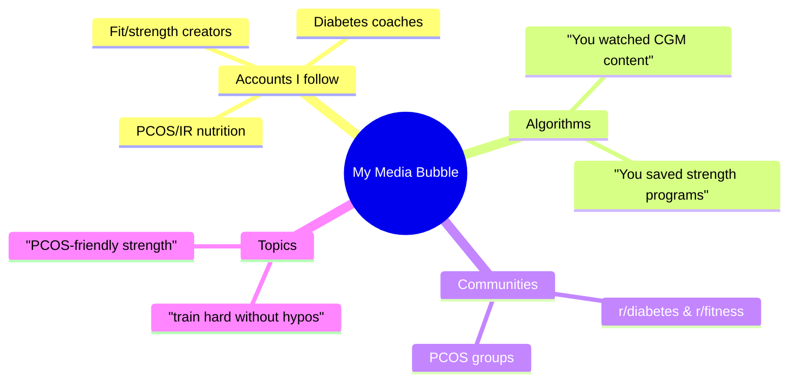
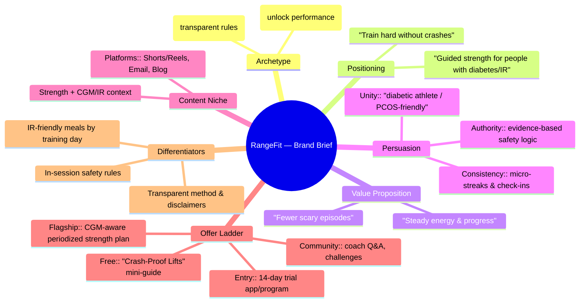
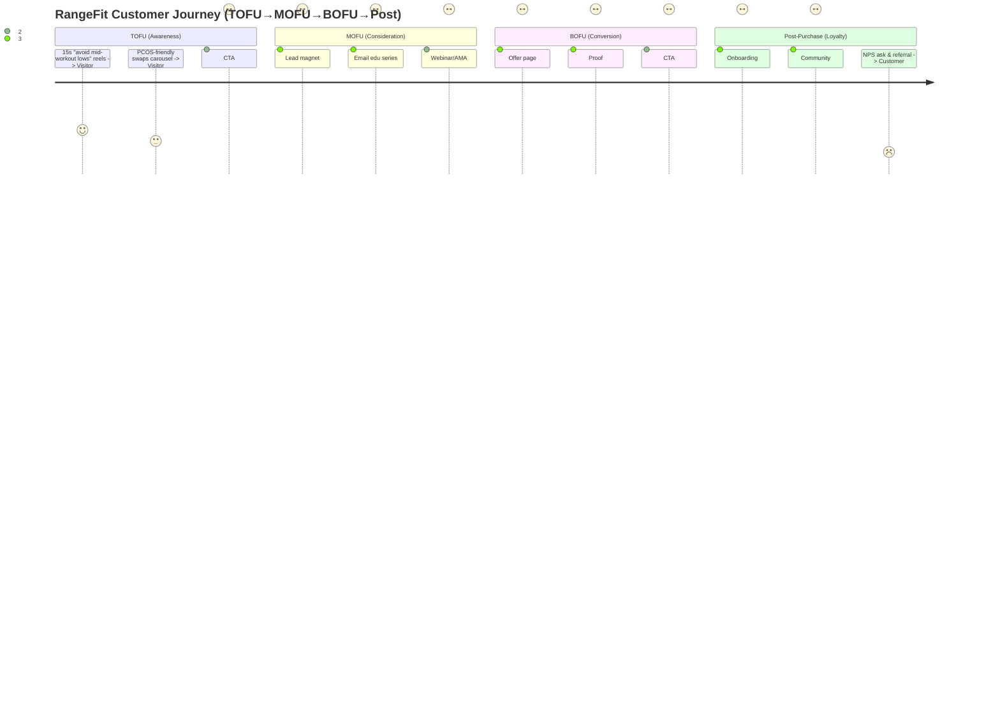

Below is a **copy‑paste‑ready** slide deck (10 slides). I used Mermaid for every visual. Where evidence/sources are needed, I marked small placeholders so you can drop your screenshots/links. I grounded the content in your repo’s discovery docs and executive summary (citations inline).

---

### **Slide 1 — Title & Topic (Media Bubble Evidence)**

**RangeFit** — CGM‑aware strength training for people with diabetes & insulin resistance (IR)
**Why it’s in my feeds:** fitness + CGM + PCOS/IR content, algorithmic recs, and niche creator networks.&#x20;

**Evidence placeholders (replace with your links/screens):**

* [ ] Reel/short: \_\_\_\_\_\_\_\_\_\_\_\_\_\_\_\_\_\_\_\_\_\_ (hook, promise, CTA)
* [ ] Blog/article: \_\_\_\_\_\_\_\_\_\_\_\_\_\_\_\_\_\_\_\_\_\_ (what claim pulled you in)
* [ ] Influencer post: \_\_\_\_\_\_\_\_\_\_\_\_\_\_\_\_\_\_\_\_\_\_ (angle/persuasion)
* [ ] Community thread: \_\_\_\_\_\_\_\_\_\_\_\_\_\_\_\_\_\_\_\_\_\_ (pain point voiced)



---

### **Slide 2 — Competitive Landscape (Table + Map)**

| Competitor              | Archetype      | Persuasion Levers         | Content Niche                                                        | Top CTA                 | Key KPI (inferred)      |
| ----------------------- | -------------- | ------------------------- | -------------------------------------------------------------------- | ----------------------- | ----------------------- |
| **Fitbod**              | Hero           | Social Proof, Consistency | Strength coaching (no glucose)                                       | Start plan              | Trials/retention        |
| **Freeletics**          | Hero/Explorer  | Authority, Liking         | AI coach & nutrition (no diabetes context)                           | Take assessment         | App install             |
| **mySugr**              | Caregiver/Sage | Authority, Consistency    | Diabetes logging & educator coaching (no workouts)                   | Log & learn             | Streaks/log-ins         |
| **Dexcom/LibreView**    | Sage           | Authority, Unity          | CGM data & insights (not prescriptive training)                      | View insights           | Time-in-app/data share  |
| **Supersapiens/Levels** | Explorer/Sage  | Authority, Social Proof   | Metabolic insights (limited workout prescription; endurance‑leaning) | Understand your glucose | DAU/retention           |

> *Finding:* No player combines **CGM/IR awareness + structured strength periodization + in‑session safety rules**—that’s the RangeFit gap.&#x20;

**Landscape Map (illustrative):**

```mermaid
quadrantChart
  title Diabetes-Aware x Prescriptive Workouts
  x-axis Low Diabetes-Aware --> High Diabetes-Aware
  y-axis Low Prescriptive --> High Prescriptive
  quadrant-1 "High Rx / Low Diabetes-Aware"
  quadrant-2 "High Rx / High Diabetes-Aware"
  quadrant-3 "Low Rx / Low Diabetes-Aware"
  quadrant-4 "Low Rx / High Diabetes-Aware"
  Fitbod: [0.1, 0.8]
  Freeletics: [0.1, 0.7]
  mySugr: [0.8, 0.1]
  Dexcom/Libre: [0.9, 0.2]
  Supersapiens/Levels: [0.8, 0.3]
  RangeFit (proposed): [0.9, 0.9]
```

---

### **Slide 3 — Content Audit Highlights (Best/Worst Posts)**

> Use these **slots** to paste your actual post links & screenshots. Structure follows the audit template.&#x20;

**Best‑performing patterns (from audit):**

* *Short, specific “how‑to avoid lows during lifts” reels* with clear micro‑CTAs (save/share). **Add links →** \_\_\_\_\_\_\_\_&#x20;
* *PCOS “friendly swaps” carousels* (low‑glycemic meals + simple rules). **Add links →** \_\_\_\_\_\_\_\_&#x20;

**Weak/underperforming patterns:**

* Generic “get fit fast” claims without diabetes/IR context. **Add links →** \_\_\_\_\_\_\_\_&#x20;
* Dense, clinical copy that implies medical treatment claims (risk + low engagement). **Add links →** \_\_\_\_\_\_\_\_&#x20;

**What this suggests:** Lean into *specific safety logic & practical swaps*; avoid medicalized claims; keep CTAs micro‑committal.&#x20;

---

### **Slide 4 — Gap Analysis (Bullets)**

* **Underserved segments:** T1D lifters (fear hypos), T2D rebuilders (low‑friction plans), pre‑diabetics (avoid overwhelm), women with PCOS/IR (steady energy, friendly strength).&#x20;
* **Missing persuasion levers:** Unity (identity: diabetic athletes, PCOS‑friendly), Consistency (micro‑commitments), Authority (transparent safety rules).&#x20;
* **Weak funnel stages across competitors:** MOFU education on safety logic; BOFU proof tailored to diabetes/IR; post‑purchase onboarding/community.&#x20;
* **Why now:** CGM adoption rising in diabetes populations (Type 1 \~50%+ adults; Type 2 \~13% in 2021 with rapid growth) though still limited outside diabetes—timely but niche.&#x20;

---

### **Slide 5 — Opportunity Statement**

> **For active adults with diabetes or insulin resistance,** we deliver **safe, consistent progress** by adapting workouts and low‑glycemic meals to **daily glucose/metabolic context**, **unlike** fitness apps that ignore glucose and tracking apps that stop at logging.&#x20;

---

### **Slide 6 — Brand Brief (Visualized)**



> One‑pager strategy mirrors your **Brand Brief** template & discovery notes.

---

### **Slide 7 — Persona (Profile Slide)**

**Persona — “Maya” (PCOS/IR)**

* 32, marketing manager; seeks sustainable strength with stable energy; prefers low‑glycemic meals & compassionate guidance.
* **JTBD:** PCOS‑friendly training & fueling; simpler plans on stressful days; quick meal swaps.
* **Pains/Fears:** energy dips, conflicting advice, fear of “bulking.”
* **Proof to Believe:** simple rules, success stories, transparent method, no clinical claims.
* **Where online:** TikTok/IG/YT in PCOS & women’s fitness.&#x20;

> Evidence in exec summary supports PCOS/IR need for guidance & adherence support.&#x20;

---

### **Slide 8 — Customer Journey Map (Diagram)**



> Assets & CTAs guided by your journey template and gaps noted (MOFU/BOFU/post‑purchase).&#x20;

---

### **Slide 9 — Success Metrics & KPIs (30/60/90)**

**Acquisition**

* **CTR to LP:** 2% / 3% / 4% *(avg ≈2% industry; upper values aspirational)*
* **LP → Email opt‑in:** 20% / 25% / 30%
* **Email CTR:** 5% / 8% / 10% *(8–12% = top‑tier; mark “aspirational”)*&#x20;

**Activation & Conversion**

* **Trial start (LP conv.):** 6% / 8% / 10% *(avg ≈5–6%)*
* **Trial → Paid:** 7% / 9% / 12% *(context: freemium norms)*&#x20;

**Engagement & Retention**

* **D1/D7/D30:** 55% / 30% / **15%** *(D30 15% is stretch; fitness median ≈3–6%)*
* **Weekly plan adherence:** ≥50% / 55% / **60%** *(≥60% long‑term is strong)*&#x20;

**Notes:** Mark stretch goals as **aspirational** and benchmark in footers to set expectations.&#x20;

---

### **Slide 10 — Closing Takeaway**

**Thesis:** The open space is **CGM/IR‑aware strength periodization with in‑session safety rules**—clear need, credible timing, and a defendable content niche.&#x20;

**Next steps (evidence‑first):**

1. **Pilot (10–20 users)** across T1D/T2D/PCOS; track workout incidents, adherence, perceived energy; publish case studies.
2. **Regulatory hygiene:** maintain **general wellness** positioning; tighten copy & disclaimers; avoid clinical claims.
3. **Non‑CGM path:** value via manual logs/proxies until sensors broaden.&#x20;

---

## (Optional) Appendix Blocks You Can Paste After Slide 10

**A. Persona — “Alex” (T1D lifter)** *(use if you want a second persona slide)*
Jobs‑to‑be‑done focus: finish heavy sessions without lows; adapt quickly to day changes; simple in‑session tweaks.&#x20;

**B. Sources (tiny footer for your deck)**

* Competitive gaps & KPI realism cross‑checked in **Executive Summary (Oct 2025)**.&#x20;
* Gap/Opportunity, Personas, Journey scaffolds from your discovery repo (templates + drafts).&#x20;
* Assignment outline & rubric framing.&#x20;

---

### What to Customize Before Submission

* Replace **Slide 1** and **Slide 3** placeholders with **your** screenshots/links + engagement notes.
* If you prefer **Alex (T1D)** or **Sam (T2D)** as the primary persona, swap Slide 7 content using the repo persona pages.&#x20;
* Add a tiny **disclaimer** footer: *“Not a medical device; for general wellness/fitness.”* (aligns with exec summary guidance).&#x20;

If you’d like, I can also produce a **one‑page “Sources” slide** and a **Risks & Mitigations** slide in the same format.
